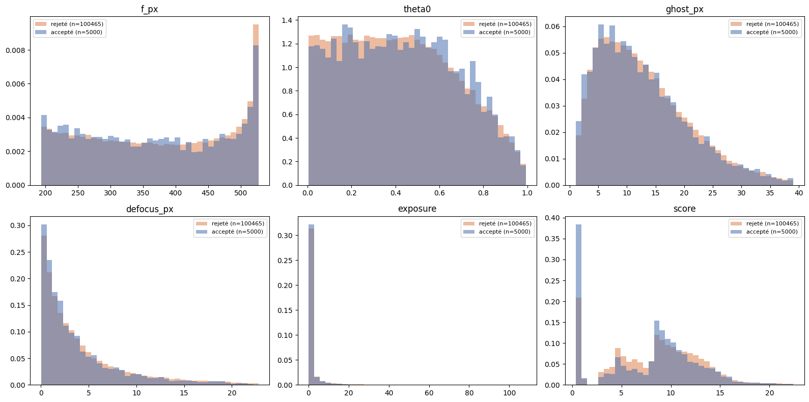
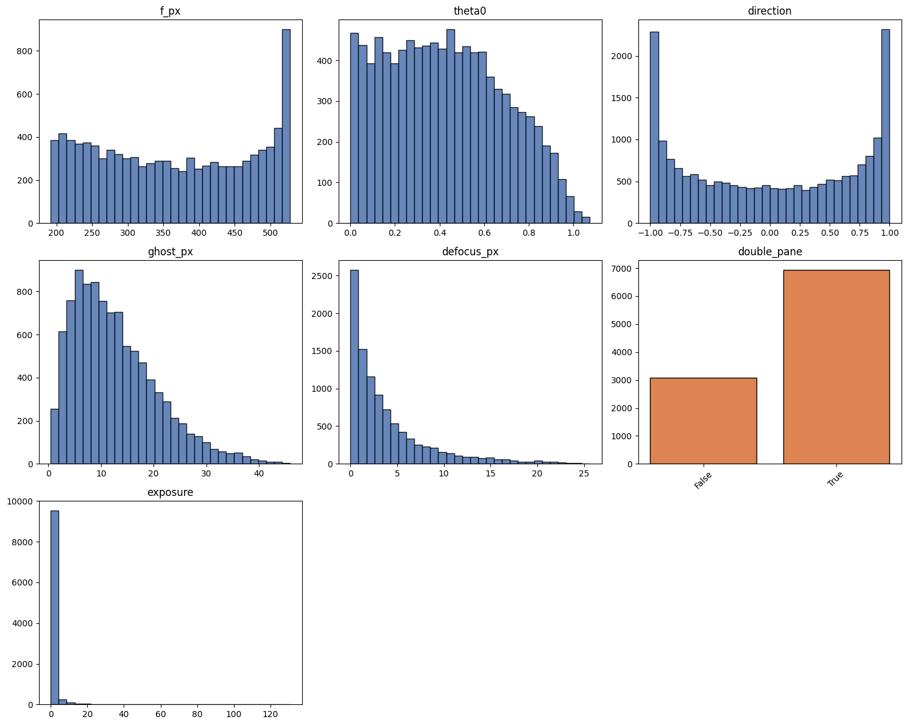

# Distribution du tri de simulation — état avant passage au tirage uniforme

**Date :** 2026-09-10
**Source :** sorties de cellules de `data_clean.ipynb` (run de diagnostic à 5 000 exemples)
**Statut :** configuration **abandonnée** — conservée comme référence avant le passage au
tirage de paires uniforme et à l'élargissement de `vis_max`.

---

## 1. Configuration du run

| | |
|---|---|
| Sortie | `data_fivek_dng/dataset_soomin_final_biased_biggest_2` |
| Tirage de paires | `sample_realistic_pair`, pondéré ∝ `pair_score` |
| Scène | `simulate_example` → `sample_scene2(rng, patch)` — **sans biais** |
| Fenêtre de visibilité | `vis_min, vis_max = 0.02, 0.25` |
| Essais | 105 465 |
| Acceptés | 5 000 |
| **Taux d'acceptation** | **4,74 %** (≈ 21 simulations par exemple retenu) |
| Durée | 13 min 02 s, 20 threads, 6,39 essais/s |

> Le run de production associé (`dataset_soomin_final_biased_biggest`, 10 000 groupes ×
> 2 membres, 44 min 56 s) utilise `simulate_example_k`, donc `sample_scene2(biais=True,
> biais_params=BIAS)`. Les statistiques de scène de la section 6 en proviennent ; les
> taux d'acceptation des sections 2 à 5 proviennent du run non biaisé ci-dessus.

---

## 2. Causes de rejet

### Premier critère qui échoue (`measure`, ordre des tests)

| verdict | % |
|---|---|
| ssim | 71,3 |
| visibilite | 18,3 |
| **ok** | **4,7** |
| exposition | 3,2 |
| m_mean | 2,1 |
| r_plat | 0,4 |
| ssim_std | 0,0 |

`measure` renvoie le **premier** critère qui échoue et `ssim` est testé en premier : cette
colonne surestime `ssim` et masque tous les autres. Les taux marginaux ci-dessous sont les
chiffres à citer.

### Taux d'échec marginal (chaque critère évalué indépendamment)

| critère | échec marginal | **seul responsable** |
|---|---|---|
| **visibilite** | **76,5 %** | **17,3 %** |
| ssim | 71,3 % | 2,4 % |
| ssim_std | 36,1 % | 0,0 % |
| r_plat | 29,0 % | 0,4 % |
| t_plat | 25,4 % | 0,0 % |
| exposition | 18,9 % | 1,0 % |
| m_mean | 13,4 % | 0,0 % |

### Nombre de critères échoués simultanément

| n critères | essais | % |
|---|---|---|
| 0 (accepté) | 5 000 | 4,7 |
| 1 | 22 334 | 21,2 |
| 2 | 13 183 | 12,5 |
| 3 | 28 956 | 27,5 |
| 4 | 30 769 | 29,2 |
| 5 | 4 696 | 4,5 |
| 6 | 526 | 0,5 |
| 7 | 1 | 0,0 |

Moyenne : **2,71 échecs par essai**. 61,7 % des essais ratent 3 critères ou plus — les
rejets ne sont pas des cas limites.

### Conclusions

1. **`visibilite` est le goulot.** Sur les 21,2 % d'essais qui ne ratent qu'un seul
   critère, il en représente 17,3 points (82 %). Le retirer ferait passer l'acceptation
   de 4,74 % à **22,0 %**, à qualité inchangée sur tous les autres critères.
2. **`ssim_std`, `m_mean` et `t_plat` ne sont jamais seuls responsables** (0,0 %, soit
   ~85 essais sur 105 465). Ils ne se déclenchent qu'en compagnie d'un autre critère et
   peuvent être supprimés sans changer le dataset.

---

## 3. Taux d'acceptation par paramètre (octiles)

Erreur-type par octile : **±0,19 point** (n ≈ 13 200, p ≈ 0,048).

| paramètre | étendue | en σ | lecture |
|---|---|---|---|
| **score** | 2,9 → 8,3 % | 29 σ | fort, non monotone |
| **exposure** | 3,8 → 6,0 % | 12 σ | fort, non monotone |
| defocus_px | 5,3 → 4,0 % | 7 σ | réel, monotone, faible |
| f_px | 5,2 → 4,2 % | 5 σ | réel, monotone, faible |
| ghost_px | 5,3 → 4,4 % | 5 σ | réel, monotone, faible |
| theta0 | 4,4 → 5,1 % | 4 σ | réel, monotone, faible |
| double_pane | 4,7 vs 4,8 % | 0,7 σ | **nul** |

<details>
<summary>Détail par octile</summary>

```
f_px                          theta0                        ghost_px
(192.0, 230.9]    5.2         (-0.001, 0.102]   4.4         (0.278, 4.59]     5.3
(230.9, 273.7]    4.9         (0.102, 0.203]    4.7         (4.59, 6.862]     4.8
(273.7, 321.5]    5.0         (0.203, 0.305]    4.4         (6.862, 9.2]      4.9
(321.5, 371.9]    4.8         (0.305, 0.406]    4.7         (9.2, 11.67]      4.7
(371.9, 424.4]    5.1         (0.406, 0.507]    4.5         (11.67, 14.44]    4.5
(424.4, 472.5]    4.4         (0.507, 0.616]    5.0         (14.44, 17.88]    4.7
(472.5, 510.8]    4.3         (0.616, 0.752]    5.1         (17.88, 23.01]    4.4
(510.8, 527.5]    4.2         (0.752, 1.081]    5.0         (23.01, 47.40]    4.6

defocus_px                    exposure                      score
(-0.001, 0.427]   4.9         (-0.0004, 0.0131]  4.1        (0.214, 0.923]     8.3
(0.427, 0.971]    5.3         (0.0131, 0.0338]   5.0        (0.923, 4.979]     3.5
(0.971, 1.682]    5.0         (0.0338, 0.0692]   3.9        (4.979, 7.149]     2.9
(1.682, 2.629]    5.2         (0.0692, 0.144]    4.4        (7.149, 8.886]     5.1
(2.629, 3.879]    4.6         (0.144, 0.315]     5.1        (8.886, 10.128]    5.5
(3.879, 5.85]     4.6         (0.315, 0.787]     5.7        (10.128, 11.668]   4.9
(5.85, 9.776]     4.3         (0.787, 2.984]     6.0        (11.668, 13.522]   3.4
(9.776, 26.239]   4.0         (2.984, 16920.2]   3.8        (13.522, 30.064]   4.3
```
</details>

**La géométrie de la vitre ne provoque pas les rejets.** Focale, angle, fantôme, defocus et
double vitrage modulent l'acceptation de moins d'un point sur cinq. La distribution de
paramètres optiques qui sort du tri ressemble donc à celle qui est échantillonnée : le
biais `BIAS` n'est pas mangé par le culling.

Ce qui décide, ce sont les deux variables qui décrivent **le couple de photographies**, pas
la vitre.

### Anomalie non résolue

L'octile supérieur de `score` monte à **30,064**, alors que `pair_score` tel qu'écrit en
cellule 57 plafonne à **21,0** (facteur location ∈ {0,3 ; 4,0} × facteur temps ∈ [0,7 ; 3,0]
× facteur illuminant ∈ [1,0 ; 1,75]), vérifié par simulation sur `pool_index.json`. Le
minimum observé (0,214) correspond en revanche bien au minimum théorique (0,210). Version
en mémoire probablement désynchronisée de la cellule sauvegardée.

---

## 4. Moyenne du paramètre par cause de rejet

| verdict | f_px | theta0 | ghost_px | defocus_px | exposure | score |
|---|---|---|---|---|---|---|
| exposition | 374,6 | 0,415 | 13,26 | 4,559 | 3,960 | 7,831 |
| m_mean | 381,2 | 0,381 | 13,44 | 4,594 | 6,245 | **6,606** |
| **ok** | 364,2 | 0,432 | 12,87 | 3,924 | **1,622** | 7,785 |
| r_plat | 382,2 | 0,345 | 13,69 | 5,135 | 0,868 | 8,000 |
| ssim | 371,0 | 0,421 | 13,18 | 4,318 | 4,831 | 8,445 |
| ssim_std | 417,4 | 0,335 | 12,02 | 3,977 | 3,371 | **10,464** |
| visibilite | 371,4 | 0,425 | 13,11 | 4,352 | 1,635 | **9,032** |

**`pair_score` et `measure` optimisent des objectifs opposés.** Les scores élevés partent en
`ssim_std` (10,46), `visibilite` (9,03) et `ssim` (8,45) ; les acceptés sont à 7,79. Un score
élevé signifie locations différentes (×4) + reflet extérieur de jour ou intérieur artificiel
(×2 à ×3) + illuminants très différents (×1,75), soit un reflet lumineux sur une transmission
sombre — précisément ce que `vis > 0,25` et `ssim < 0,40` rejettent.

À l'autre bout, les scores bas se font jeter par `m_mean` (6,61) : deux scènes claires du même
type qui s'additionnent et saturent.

**Queue d'exposition :** le maximum atteint **16 920**. Avec `TAU = 0.1329`, cela correspond à
un crop de luminance moyenne 7,9 × 10⁻⁶ — un crop noir amplifié jusqu'au bruit. Les acceptés
ont une exposition moyenne de 1,62 contre 6,25 pour les rejets `m_mean`.

---

## 5. Croisement sémantique (`t_loc` × `r_loc`)

| t_loc → r_loc | essais | part du budget | **vis moyen** | acceptation | part du dataset final |
|---|---|---|---|---|---|
| indoor → outdoor | 57 407 | **54,4 %** | **0,670** | 4,8 % | 55 % |
| outdoor → indoor | 33 877 | **32,1 %** | 0,131 | **3,2 %** | 22 % |
| outdoor → outdoor | 13 405 | 12,7 % | 0,295 | 8,0 % | 21 % |
| indoor → indoor | 776 | 0,7 % | 0,284 | **9,8 %** | 1,5 % |

**L'allocation du budget de calcul est inversée.** `pair_score` envoie 86 % des tirages sur
les deux combinaisons inter-locations, qui échouent aux **deux bouts opposés du même axe** :

- `indoor → outdoor` (54 % du budget) : reflet extérieur sur scène intérieure, `vis` moyen
  **0,670**, soit **2,7× le plafond**. Reflet systématiquement trop fort.
- `outdoor → indoor` (32 % du budget) : `vis` moyen 0,131, pourtant **dans** la fenêtre, mais
  pire taux d'acceptation (3,2 %). Le reflet est trop faible, donc `m ≈ t`, donc `ssim > 0,94`
  et `r_std < 0,008`.

Les deux combinaisons **même-location**, pénalisées ×0,3 par `pair_score`, ont un `vis` moyen
de 0,28–0,30 — au bord de la fenêtre, donc une distribution qui la traverse — et les meilleurs
taux d'acceptation. Elles reçoivent 13 % du budget.

---

## 6. Distribution des paramètres de scène retenus

Run de production, 10 000 groupes (`sample_scene2(biais=True, biais_params=BIAS)`) :

```
f_px         n=10000  mean=364.7    std=106.9    min=192       max=527.5   median=360.6
theta0       n=10000  mean=0.4269   std=0.2599   min=5.67e-05  max=1.074   median=0.4144
ghost_px     n=10000  mean=12.68    std=7.983    min=0.4573    max=45.9    median=11.14
defocus_px   n=10000  mean=3.908    std=4.411    min=4.35e-04  max=25.62   median=2.355
exposure     n=10000  mean=1.051    std=3.946    min=0.00207   max=130.7   median=0.1603
direction    n=20000  mean=0.0053   std=0.7071   min=-1        max=1       (vecteur 2D)
double_pane  n=10000  False=3069, True=6931
```

> `direction` est un vecteur (cos, sin), **pas une catégorie** : un `groupby("direction")`
> produit une ligne par essai (105 465 lignes, ~6 Mo de sortie). À exclure des diagnostics
> catégoriels.

---

## 7. Configuration précédente (pour comparaison)

Sortie restée en cache dans le notebook, issue d'une session antérieure. Les bornes se
lisent dans le `describe()` des acceptés (`vis` min 0,0801, max 0,4000) :

| | fenêtre `vis` | essais | acceptés | taux |
|---|---|---|---|---|
| précédente | (0,08 ; 0,40) | ~148 600 | 15 005 | **10,1 %** |
| **actuelle** | **(0,02 ; 0,25)** | 105 465 | 5 000 | **4,74 %** |

Resserrer `vis_max` de 0,40 à 0,25 a divisé le rendement par ~2,1.

Statistiques des acceptés sous la configuration précédente :

```
        ssim   ssim_std   m_mean       Ym      vis    t_std    r_std  sat_frac
mean  0.8263     0.1889   0.1514   0.1507   0.2512   0.1118   0.0387    0.0144
std   0.0845     0.0652   0.0578   0.0578   0.0842   0.0647   0.0309    0.0377
min   0.4066     0.0500   0.0734   0.0690   0.0801   0.0152   0.0080    0.0000
50%   0.8414     0.1840   0.1329   0.1328   0.2491   0.0955   0.0292    0.0000
max   0.9400     0.4193   0.4870   0.3999   0.4000   0.4335   0.2876    0.6627
```

5,9 % des acceptés dépassaient 8 % de pixels écrêtés.

---

## 8. Référence : `vis` mesuré sur les benchmarks

Mesuré hors notebook, sur les images de test. Linéarisation par `srgb_decode`
(approximation : ces images sont passées par un ISP complet avec courbe de rendu).
SIR² dispose de vrais calques reflet ; pour Real20 et Nature20, `r` est estimé par
`clip(m − t, 0, ∞)`, ce qui suppose le modèle linéaire — **chiffres moins fiables**.

| dataset | n | p10 | **p50** | p90 | max | > 0,25 |
|---|---|---|---|---|---|---|
| SIR² SolidObject | 200 | 0,041 | **0,059** | 0,121 | 0,137 | **0,0 %** |
| SIR² WildScene | 101 | 0,021 | **0,085** | 0,366 | 1,346 | 20,8 % |
| SIR² Postcard | 179 | 0,172 | **0,236** | 0,314 | 0,366 | 37,4 % |
| **SIR² complet** | **480** | **0,041** | **0,120** | **0,293** | **1,346** | **18,3 %** |
| Real20 *(estimé)* | 20 | 0,122 | 0,275 | 0,511 | 0,620 | 50,0 % |
| Nature20 *(estimé)* | 20 | 0,051 | 0,190 | 0,414 | 0,532 | 35,0 % |

Couverture de SIR² selon le plafond :

```
vis_max = 0.25  ->  81.7 %      vis_max = 0.35  ->  97.3 %
vis_max = 0.30  ->  91.2 %      vis_max = 0.40  ->  98.3 %
```

**SIR² n'est pas une distribution mais trois.** SolidObject (42 % de SIR²) a une médiane de
0,059 et pas une image au-dessus de 0,25 ; Postcard est quatre fois plus haut à 0,236.

Le tri serrait donc **par les deux bouts** : `vis_max = 0,25` coupait le haut de Postcard et
la queue de WildScene, tandis que `ssim < 0,94` et `r_std > 0,008` rejetaient les reflets
faibles du régime SolidObject.

---

## 9. Figures

### Paramètres de scène — acceptés vs rejetés



Superposition normalisée (rejeté n = 100 465, accepté n = 5 000). `f_px`, `theta0`,
`ghost_px`, `defocus_px` et `exposure` se recouvrent quasi exactement — confirmation visuelle
de la section 3. Seul `score` montre un écart net : le pic des acceptés au score le plus bas.

### Distribution des paramètres retenus



Run de production, 10 000 groupes. `f_px` bimodal (pic aux deux bornes du FOV), `theta0`
décroissant au-delà de 0,6 rad, `ghost_px` log-normal centré sur 11 px, `defocus_px` et
`exposure` à décroissance rapide avec longue queue.

---

## 10. Décision

Sur la base de ces mesures :

1. **Tirage de paires uniforme** — `pair_score` n'est qu'un proxy catégoriel du rapport de
   luminance ρ = Yr/Yt (location, time, light sont trois indicateurs de luminance de scène).
   Il est conservé comme colonne de diagnostic, plus comme échantillonneur.
   Libère ~2,6 Go (`ALL_PAIRS` + `PAIR_WEIGHTS` + `CUM_WEIGHTS`) et 6× sur le tirage.
2. **`vis_max` 0,25 → 0,5** — couvre 99 % de SIR², contre 82 %.
3. **Suppression de `ssim_std`, `m_mean`, `t_plat`** — jamais seuls responsables.

Acceptation attendue après (1) et (2) : **~40 %**, contre 4,74 % ici.

**Ce qui reste à mesurer :** PSNR par image sur les benchmarks, régressé sur leur `vis`,
ventilé par sous-ensemble SIR². Si l'écart s'effondre sur Postcard, c'est le plafond
`vis_max` ; s'il s'effondre sur SolidObject, c'est `ssim`/`r_plat` par le bas.
